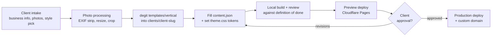

# Architecture

## Folder layout

```
websites/
  README.md
  docs/
    PHILOSOPHY.md
    ARCHITECTURE.md
    SECURITY.md
    ENGINEERING.md
    INTAKE.md
  shared/                  # the frame: components every vertical uses
    components/
      Hero.astro
      Gallery.astro
      Hours.astro
      ContactForm.astro
      Nav.astro
      Footer.astro
      ...
    layouts/
      BaseLayout.astro
    styles/
      base.css              # resets, typography scale, layout primitives
      tokens.css             # CSS custom property definitions (no values)
  templates/                # vertical-specific assemblies, one per business type
    barber/
      src/
        pages/
        content.json         # example/placeholder content
        theme.css            # default theme token values for this vertical
        images/
      astro.config.mjs
      package.json
      _headers
    lawyer/
    contractor/
    coach/
    real-estate/
    solo/
  parts/                    # optional, vertical-specific components not part of the core frame
    BookingWidget.astro
    BeforeAfterSlider.astro
    MapEmbed.astro
    ...
```

`shared/` is the skeleton. `templates/<vertical>/` is a kit built from that skeleton plus whichever `parts/` it needs. Client sites are `degit` copies of a `templates/<vertical>/` directory, generated and built outside this repo.

## The shared / vertical / theme split

Three layers, each with a single responsibility:

1. **Shared components (`shared/`)**. Structure and behavior only. A `Gallery.astro` component knows how to lay out a horizontal scroll-snap track and render images; it has no opinion on color, font, or business type. Every prop it accepts is generic: `images`, `alt` text, `aspectRatio`. Never a business-specific string, never a hardcoded color or font.

2. **Vertical templates (`templates/<vertical>/`)**. Page composition and vertical-specific parts. This is where a barber site includes a `BookingWidget` and a lawyer site includes a `CredentialsList`, both drawing from `shared/` for everything else. The vertical layer decides which components exist on the page and in what order; it does not redefine how any shared component works internally.

3. **Theme (per-client `theme.css` + `content.json`)**. Visual identity and copy. Colors, fonts, spacing scale (if varied), business name, hours, service list, image paths. This is the only layer that changes per client. Applying a new client's brand should never require touching a `.astro` file.

A request for a new visual style is a theme change. A request for a new page section is a vertical template change. A request for new interactive behavior is a shared component or `parts/` change. Knowing which layer a request belongs to is the main architectural discipline this system requires.

## The content.json contract

Every client site has exactly one `content.json` at `src/content.json`. It is the single source of truth for copy, contact info, hours, and image references. No copy lives inside `.astro` files.

Shape (fields vary slightly by vertical, core shape is shared):

```json
{
  "business": {
    "name": "Fade City Barbershop",
    "tagline": "Fresh cuts, no appointment drama",
    "phone": "+1-555-010-0100",
    "email": "book@fadecitybarber.com",
    "address": "123 Main St, Springfield, ST 00000"
  },
  "hours": [
    { "day": "Mon-Fri", "open": "09:00", "close": "19:00" },
    { "day": "Sat", "open": "09:00", "close": "16:00" },
    { "day": "Sun", "open": null, "close": null }
  ],
  "services": [
    { "name": "Fade", "price": "$35", "duration": "30 min" }
  ],
  "gallery": [
    { "src": "/images/shop-1.jpg", "alt": "Barbershop interior with three chairs" }
  ],
  "theme": {
    "fontPairing": "sans-serif-bold",
    "colorScheme": "warm-neutral"
  },
  "formEndpoint": "https://formspree.io/f/xxxxxxx"
}
```

Components consume this file by prop, not by importing it directly wherever convenient. Pages read `content.json` once and pass typed slices down to components. This keeps the shared component contracts stable even as the vertical field set grows.

## Request flow: template to deployed client site



Nothing in this flow edits `shared/` or `templates/`. Those only change when the frame itself needs a new capability, which is a template-library change reviewed on its own, separate from any single client delivery.
